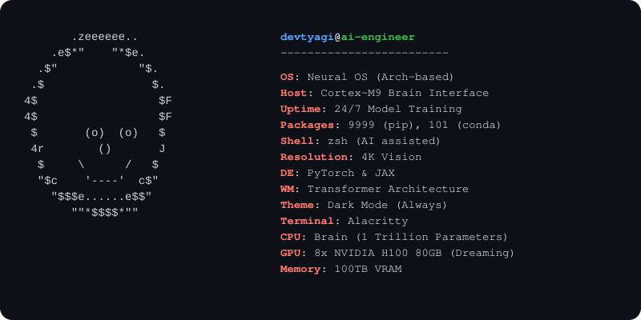

<h1><code>neofetch --user devtyagi3909</code></h1>

<picture>
  <source media="(prefers-color-scheme: dark)" srcset="neofetch.svg">
  <source media="(prefers-color-scheme: light)" srcset="neofetch.svg">
  
</picture>

### 🚀 About Me
- 🧠 Pivoted from **RTL/FPGA Engineering** to **AI Engineering**.
- 🤖 Building robust Neural Networks, fine-tuning LLMs, and scaling AI infrastructure.
- ⚡ Currently working with **PyTorch, JAX, CUDA, and vLLM**.
- 🛠️ Merging hardware-level intuition with high-level AI concepts.

---

### 🛠️ Tech Stack

---

<picture>
  <source media="(prefers-color-scheme: dark)" srcset="https://raw.githubusercontent.com/devtyagi3909/devtyagi3909/output/snake.svg?v=14"/>
  
</picture>

